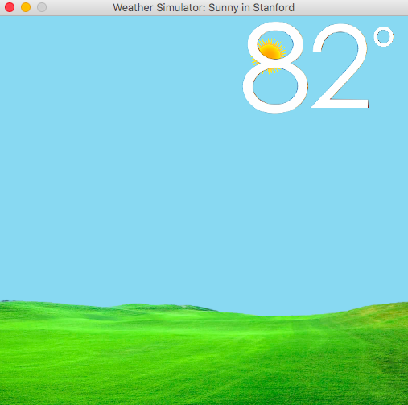

Weather simulator I created in 2015. Run World.java to execute the program.

Press "n" while in the window to input a location to get weather for that location:

The view changes according to cloud cover, precipitation, and time data at that location.

Press "d" to enter demo mode. Press keys 1-9 to display different possible weather conditions. Press d again to exit demo mode.

Credit to Yahoo Weather API for weather data.
